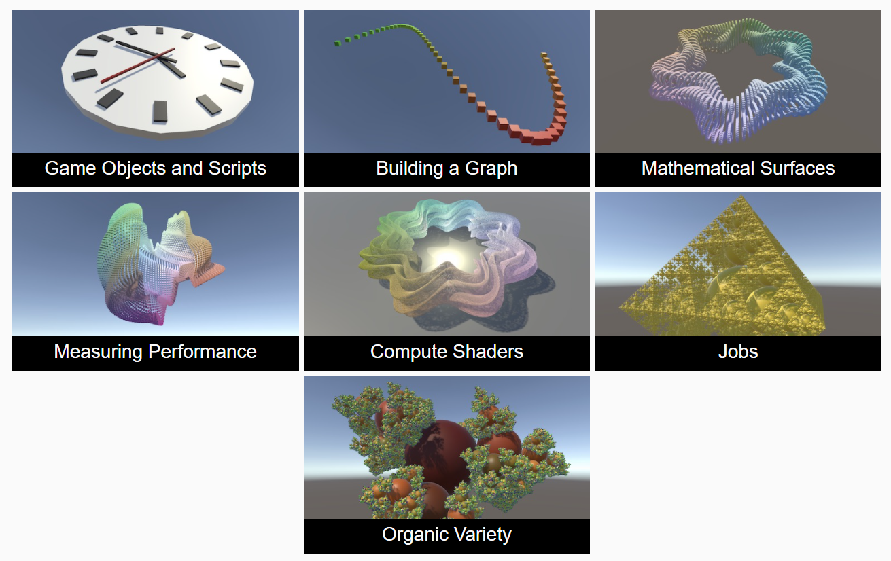

# Unity引擎入门和C#编程入门

## Features

- [x] **Game Objects and Scripts**

  Build a clock with simple objects.

  Write a C# script.

  Rotate the clock's arms to show the time.

  Animate the arms.

- [x] **Building a Graph**

  Create a prefab.

  Instantiate multiple cubes.

  Show a mathematical function.

  Create a surface shader and shader graph.

  Animate the graph.

- [ ] ...

 

## 参考资料

1. [_Unity Tutorials: Basics_](https://catlikecoding.com/unity/tutorials/basics/)
1. [_Unity基础教程系列(新)_](https://zhuanlan.zhihu.com/p/346208723)
2. [_Unity引擎入门和C#编程入门5篇_](https://zhuanlan.zhihu.com/p/159120874)
3. [_[教程汇总+持续更新]Unity从入门到入坟_](https://zhuanlan.zhihu.com/p/151238164)
4. [_Unity 学习资源_](https://zhuanlan.zhihu.com/p/29383687)
4. [_Unity 用户手册 2020.3 (LTS)_](https://docs.unity.cn/cn/2020.3/Manual/index.html)